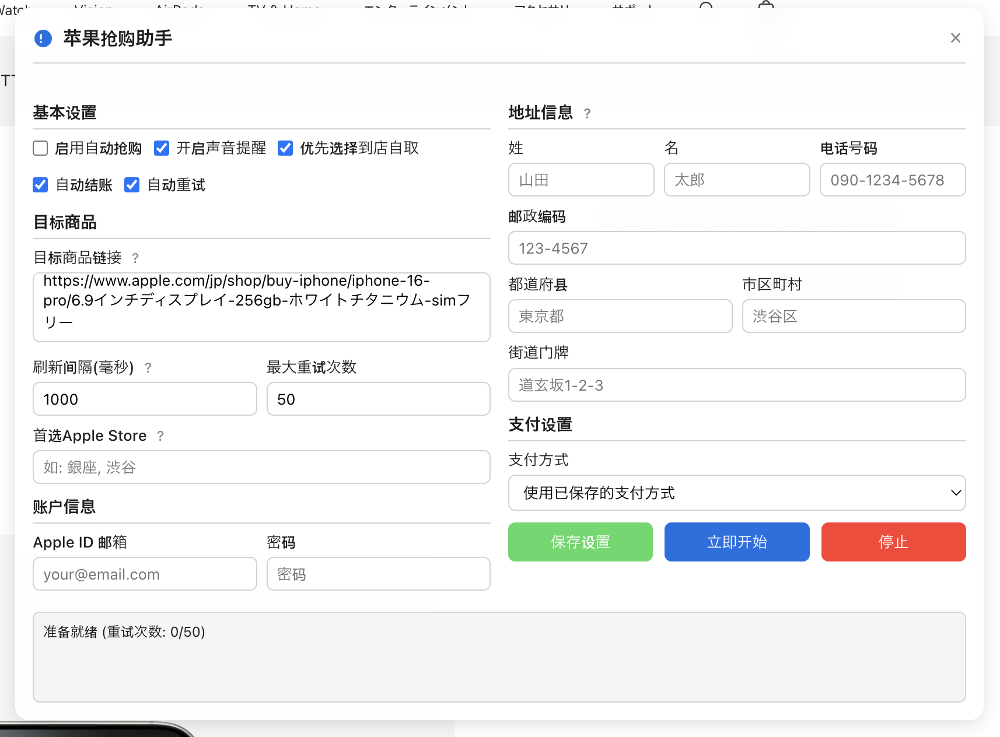

# 苹果日本官网抢购助手
一个功能强大的浏览器脚本，帮助用户在苹果日本官网抢购热门产品。支持多商品监控、到店自取优先、地址自动填写和支付流程自动化。

## 程序界面
<!-- 默认载入界面示例 -->

## 📋 功能特点

- **现代化界面设计**：美观直观的控制面板，方便操作
- **多商品监控**：同时监控多个商品链接，随机检查避免被系统检测
- **自动选择规格**：自动选择商品的颜色、容量等规格
- **到店自取优先**：可配置优先选择到店自取，并支持指定首选门店
- **自动登录**：填写Apple ID和密码，支持记住验证信息
- **地址自动填写**：根据配置自动填写日本地址格式
- **支付方式选择**：支持选择已保存的支付方式、货到付款或输入新信用卡
- **状态通知**：详细的状态更新和错误通知，包括声音提醒
- **高度可定制**：多种设置选项满足不同抢购需求

## 🔧 安装方法

1. 首先安装用户脚本管理器扩展：
   - Chrome/Edge: [Tampermonkey](https://www.tampermonkey.net/)
   - Firefox: [Greasemonkey](https://addons.mozilla.org/en-US/firefox/addon/greasemonkey/) 或 [Tampermonkey](https://addons.mozilla.org/en-US/firefox/addon/tampermonkey/)

2. 安装本脚本：
   - 方法1：点击[此链接](#)直接安装
   - 方法2：复制 `apple-autobuy-script.js` 的内容，在Tampermonkey中新建脚本并粘贴

3. 脚本会自动在苹果日本官网的相关页面上启动

## 📝 使用说明

### 基本设置

- **启用自动抢购**：总开关，开启后脚本会自动工作
- **开启声音提醒**：操作成功、错误等状态会有声音反馈
- **优先选择到店自取**：开启后会优先尝试到店自取选项
- **自动结账**：全流程自动化，包括最终确认订单步骤
- **自动重试**：遇到错误或商品不可购买时自动重试

### 目标商品

- **目标商品链接**：输入想要购买的商品URL，每行一个
- **刷新间隔**：检查商品可用性的时间间隔（毫秒）
- **最大重试次数**：达到此次数后会自动停止
- **首选Apple Store**：优先选择的自取门店，用逗号分隔

### 账户信息

- 填写Apple ID邮箱和密码，用于自动登录

### 地址信息

- 填写收货地址信息（日本地址格式）
- 如果Apple账户中已保存地址，可以不填

### 支付设置

- **支付方式**：选择已保存的支付方式、货到付款或信用卡
- **信用卡信息**：选择信用卡方式时填写卡号、有效期和安全码

## ⚠️ 免责声明

- 本脚本仅供学习研究使用，使用本脚本可能违反苹果官网的使用条款
- 作者不对使用本脚本导致的任何后果负责，包括但不限于账户被封、订单被取消等
- 请合理使用，尊重苹果官网的正常运营

## 📌 常见问题

### 脚本无法运行
确保已正确安装Tampermonkey并启用本脚本。检查浏览器控制台是否有错误信息。

### 无法自动登录
某些情况下苹果会要求双重验证，此时需手动输入验证码。建议在抢购前先手动登录。

### 商品一直显示不可购买
热门商品库存紧张属正常现象，请保持耐心。可尝试增加目标商品链接或减小刷新间隔。

### 被苹果官网检测和限制
过于频繁的请求可能触发苹果的防护机制。建议设置合理的刷新间隔（不低于500ms）。

## 📄 许可证

本项目采用MIT许可证 - 详见[LICENSE](LICENSE)文件

---

*本脚本不隶属于Apple Inc.，纯属第三方工具*

